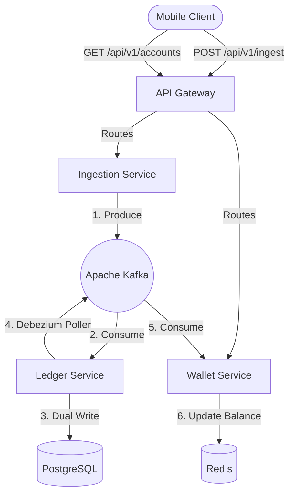

# FinLedger Platform


A cloud-native, event-driven banking engine engineered from the ground up for zero-trust environments, ultra-low latency, and massive horizontal scale. 

FinLedger implements enterprise architectural patterns including **CQRS**, the **Transactional Outbox Pattern**, and **Strict Double-Entry Bookkeeping**, all deployed via a 100% automated **GitOps** pipeline.

##  System Architecture

The platform consists of four distinct Spring Boot microservices, decoupled entirely via Apache Kafka to ensure maximum fault tolerance.



### The 4 Microservices:
1. **API Gateway (`api-gateway`)**: The edge proxy routing traffic to backend services securely.
2. **Ingestion Service (`ingestion-service`)**: The Write Edge. Accepts high-throughput transactions, performs syntactic validation, and asynchronously pushes commands to Kafka.
3. **Ledger Service (`ledger-service`)**: The Domain Core. An asynchronous, HTTP-less service that enforces Double-Entry Bookkeeping. It implements the **Transactional Outbox Pattern** to safely dual-write to PostgreSQL and emit committed events without distributed two-phase commits.
4. **Wallet Service (`wallet-service`)**: The Read Edge. Listens for `LedgerCommitted` events, pre-calculates running balances, and caches them in Redis for instant $O(1)$ read performance.

---

## Security & GitOps (The Pipeline)

FinLedger is deployed using a world-class CI/CD pipeline adhering to strict twelve-factor app principles.

- **Hardened Containers**: All services are built using multi-stage Dockerfiles. The Java application runs as a powerless, non-root user (`appuser:appgroup`) inside a minimal Linux base image.
- **Secret Management**: Passwords are never hardcoded. Kubernetes manages all credentials via encrypted `Secret` objects, injecting them dynamically into the application environment at boot.
- **Continuous Integration (GitHub Actions)**: A parallelized matrix workflow compiles the Java 26 code and securely pushes the hardened images to the GitHub Container Registry (`ghcr.io`).
- **Continuous Deployment (Argo CD)**: Argo CD lives inside the Kubernetes cluster, continuously monitoring this repository. Drift between the cluster state and the `k8s-manifests/` directory triggers an automatic, zero-downtime rolling deployment.

---

## Local Deployment Guide

To spin up the entire banking engine on your local machine using Kubernetes (Minikube):

### 1. Provision the Cluster
```bash
minikube start
helm repo add bitnami https://charts.bitnami.com/bitnami
helm repo update
```

### 2. Inject Secrets
Create a `.env` file at the root of the project with your database passwords, then inject it into the cluster:
```bash
kubectl create secret generic ledger-secrets --from-env-file=.env
```

### 3. Deploy Stateful Infrastructure
```bash
helm install postgres bitnami/postgresql \
  --set auth.existingSecret=ledger-secrets \
  --set auth.secretKeys.adminPasswordKey=POSTGRES_PASSWORD \
  --set auth.secretKeys.userPasswordKey=POSTGRES_PASSWORD \
  --set auth.database=ledger

helm install redis bitnami/redis \
  --set architecture=standalone \
  --set auth.enabled=false

helm install kafka bitnami/kafka \
  --set kraft.enabled=true \
  --set zookeeper.enabled=false
```

### 4. Deploy FinLedger Microservices
```bash
kubectl apply -f k8s-manifests/microservices.yaml
```
